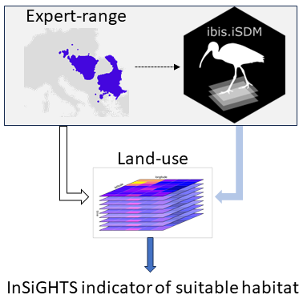

<!-- README.md is generated from README.Rmd. Please edit that file -->

# Implementation of the InSiGHTS framework

<!-- badges: start -->

[](https://github.com/iiasa/insights/actions/workflows/R-CMD-check.yaml)
[](https://lifecycle.r-lib.org/articles/stages.html#experimental)
[](https://creativecommons.org/licenses/by/4.0/)
[](https://app.codecov.io/gh/iiasa/insights?branch=main)<!-- badges: end -->

This R-package provides a IIASA implementation of the InSiGHTS Index of
Habitat Availability. The index captures the amount of suitable habitat
within the current or a future range of a species. This range can be
taken either from existing range maps (e.g. IUCN) or from estimates
obtained through species distribution models.



In it’s basic configuration, the InSiGHTS framework combines the
climatic suitability from a SDM with a area of habitat (AOH) refinement
to obtain the suitable habitat for each time steps. The InSiGHTS Index
of Habitat Availability can then be defined for any given species $s$
and timestep $t$ as:

$Insights_{s,t} = \frac{AOH_{s,t} - AOH_{s, t_{ref}}}{AOH_{s, t_{ref}}}$,
where $t_{ref}$ indicates a reference or starting year.

More information on the InSiGHTS framework can be found in [Pearson et
al. 2004](https://doi.org/10.1046/j.1466-822X.2003.00042.x), [Rondini
and Visconti 2015](https://doi.org/10.1111/cobi.12532), [Visconti et
al. 2016](https://doi.org/10.1111/conl.12159) or [Baisero et
al. (2021)](https://doi.org/10.1016/j.oneear.2020.05.015).

The package is part of the
[IIASA-BEC](https://iiasa.ac.at/programs/bnr/bec) suite of biodiversity
indicators and is coupled with the
[ibis.iSDM](https://iiasa.github.io/ibis.iSDM/) species distribution
model.

## Installation

You can install the development version of Insights from
[GitHub](https://github.com/) with:

``` r
# install.packages("devtools")
devtools::install_github("iiasa/insights")
```

The package depends on the
[ibis.iSDM](https://iiasa.github.io/ibis.iSDM/) package, which is
currently only available via github.

## Basic usage and examples

``` r
# Basic packages for use
library(ibis.iSDM)
library(insights)
library(glmnet)
library(terra)
```

Now we use the **ibis.iSDM** package to train a simple SDM and apply the
InSiGHTS on it. The assumption here is that the SDMs are created using
climatic variables (temperature, precipitation, etc.) only so as to
create a climatic envelope model. The refinement with time series of
land-use is done posthoc on the resulting prediction. Note that this
also works on any other range estimate provided directly as a
SpatRaster.

``` r
# Load test data from ibis.iSDM package
background <- terra::rast(system.file('extdata/europegrid_50km.tif', package='ibis.iSDM',mustWork = TRUE))
virtual_points <- sf::st_read(system.file('extdata/input_data.gpkg', package='ibis.iSDM',mustWork = TRUE),'points',quiet = TRUE)
# Get some future predictors
ll <- list.files(system.file('extdata/predictors_presfuture/',package = "ibis.iSDM",mustWork = TRUE),
                 full.names = T)
# Load the same files future ones
suppressWarnings(
  pred_future <- stars::read_stars(ll) |> stars:::slice.stars('Time', seq(1, 86, by = 10))
)
sf::st_crs(pred_future) <- sf::st_crs(4326)

# Get only climatic predictors and take the first time slot
pred_climate <- pred_future |> stars:::select.stars(bio01, bio12)
predictors <- ibis.iSDM:::stars_to_raster(pred_climate, 1)[[1]]

# Add some pseudo-absence data
virtual_points <- ibis.iSDM::add_pseudoabsence(virtual_points,
                                               field_occurrence = 'Observed',
                                               template = background)

# Now train a small little model
fit <- distribution(background) |> # Prediction domain
  add_biodiversity_poipa(virtual_points) |> # Add presence-only point data
  add_predictors(predictors) |> # Add simple predictors
  engine_glmnet() |> # Use glmnet for estimation
  train(verbose = FALSE) |> # Train the model 
  threshold(method = "perc", value = .33) # Percentile threshold

# --- #
# Now load some fractional land-use layers relevant for the species
# Here we assume the species only occurs in Grassland and Sparse vegetation
lu <- c(
  terra::rast(system.file('extdata/Grassland.tif', package='insights',mustWork = TRUE)),
  terra::rast(system.file('extdata/Sparsely.vegetated.areas.tif', package='insights',mustWork = TRUE))
) / 10000

# Summarize 
out <- insights_fraction(range = fit,lu = lu)

plot(out, col = c("grey90", "#FDE8A9", "#FBD35C", "#D1C34A", "#8EB65C",
                  "#56AA71", "#59A498", "#5C9EBF", "#5C8BAE", "#597182"),
     main = "Suitable habitat")
```


``` r

# Summarize
insights_summary(out)
#>   time suitability unit
#> 1   NA    265314.1  km2
```

Of course it is also possible to directly supply a multi-dimensional
gridded file using the *stars* package or directly through the ibis.iSDM
scenario functionalities (see example below).

``` r

# Create a future scenario
sc <- scenario(fit) |>
  add_predictors(env = pred_climate, transform = 'scale', derivates = "none") |>
  threshold() |>
  project()
#> [Setup] 2023-07-29 18:05:07 | Adding scenario predictors...
#> [Setup] 2023-07-29 18:05:07 | Transforming predictors...
#> [Scenario] 2023-07-29 18:05:08 | Starting suitability projections for 9 timesteps.

# --- #
# Now apply insights using time series of future land use
lu <- pred_future |> stars:::select.stars(primn, secdf)
# Normalize for the sake of an example. Note that fractions are needed!
lu <- ibis.iSDM::predictor_transform(lu, "norm") |> round(2) 
out <- insights_fraction(range = sc,
                         lu = lu)

# Summarize
o <- insights_summary(out)
#> Linking to GEOS 3.9.3, GDAL 3.5.2, PROJ 8.2.1; sf_use_s2() is FALSE

plot(o$suitability~o$band, type = "b",
     main = "InSiGHTS index",
     ylab = "Suitable habitat relative to 2015",
     xlab = "Year")
```


## Citations

Jung M (2023). *insights: An R implementation of the InSiGHTS
framework*. R package version 0.2.

P. Visconti, M. Bakkenes, D. Baisero, T. Brooks, S.H.M. Butchart, L.
Joppa, R. Alkemade, M. Di Marco, L. Santini, M. Hoffmann, C. Rondinini
*Projecting global biodiversity indicators under future development
scenarios* Conserv. Lett., 9 (2016), pp. 5-13
[DOI](https://doi.org/10.1111/conl.12159)

C. Rondinini and P. Visconti, *Scenarios of large mammal loss in Europe
for the 21st century* Conserv. Biol., 29 (2015), pp. 1028-1036
[DOI](https://doi.org/10.1111/cobi.12532)

## Acknowledgement <a href="https://iiasa.ac.at"></a>

**InSiGHTS** is developed and maintained by the [Biodiversity, Ecology
and Conservation group](https://iiasa.ac.at/programs/bnr/bec) at the
International Institute for Applied Systems Analysis (IIASA), Austria.
